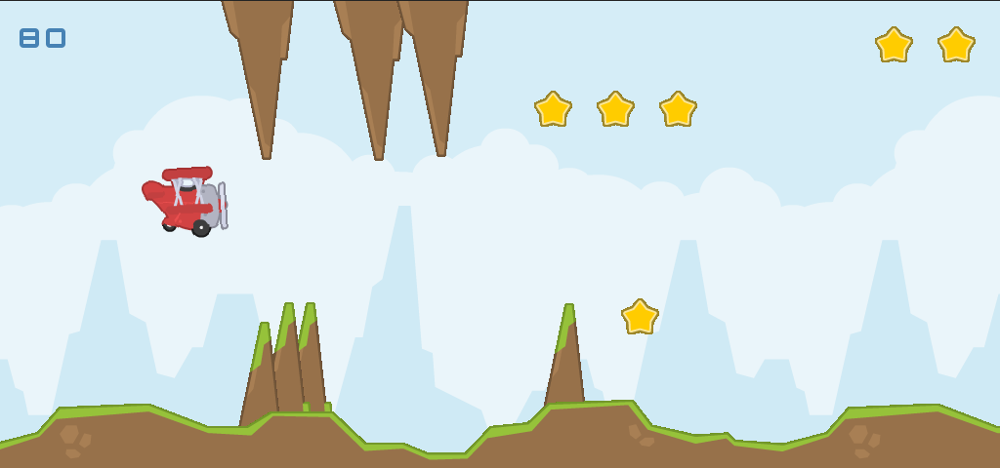

# Tappy Plane

## Description
After a couple of months of my programming journey, I decided to give game development a try. I used pygame and made **Tappy Plane**, inspired by a popular mobile game. I have made a small design change in the behavior of the plane controlled by the player to better simulate fluid flying motion instead of bird wings flapping.

## Installation
To download the game, clone this repository using git or download files manually. Then simply run **main.py** using Python.
The game requires pygame and pytweening libraries to run (exact versions are listed in requirements.txt file).

## Usage
Use **Spacebar** to propel your plane upwards. Try to avoid numerous obstacles and collect as many stars as you can to achieve a high score.

## Contact
If you have any insight, want to ask a question or just say hi, feel free to contact me using iiron@slmail.me

## Credits:
Special thanks to Chris Bradfield from [KidsCanCode](https://www.youtube.com/c/KidscancodeOrg) for creating awesome tutorials.

- "Tappy Plane" by [Kenney.nl](https://kenney.nl) is licensed under (CC0 1.0 Universal)
- "Awake! (Megawall-10)" by [cynicmusic]( http://cynicmusic.com) is licensed under (CC0 1.0)
- "Menu Loop" by Akikazer is licensed under (CC0 1.0)
- "airplane_prop.ogg" by [jakobthiesen](https://opengameart.org/node/132364) is licensed under (CC BY) 3.0
 
## License:
This project is licensed under GPL-3.0-or-later. Full text is added in COPYING.txt file.